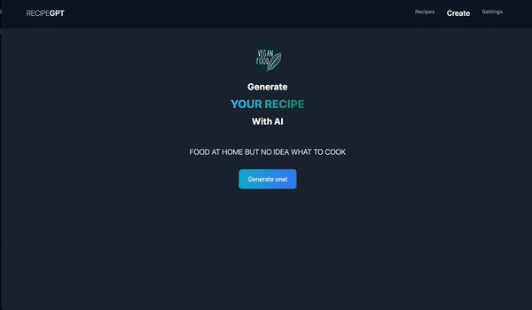

# Recipe-GPT

## Why using recipe generator ?

Looking for recipe inspiration can be a daunting task, especially when you don't have a lot of ingredients at home. That's where Recipe-GPT comes in! With this AI-powered recipe generator, you can quickly and easily generate recipes based on the ingredients you have on hand.

You want to try it out ?

Check [Demo](https://recipes-gpt.xyz) yourself



## How to use it ?

The main functionality is based on the OpenAI-API. Therefore, its required to add your own API-Key under settings. The Key is stored in the localstorage of the browser and will not be send to the SvelteKit API. 

## Developing

Once you've created a project and installed dependencies with `npm install` , start a development server:

```bash
npm run dev -- --open
```

## Building

To create a production version of your app:

```bash
npm run build
```